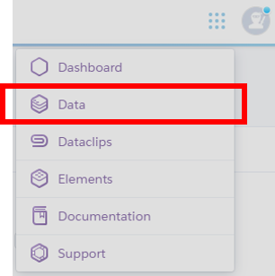
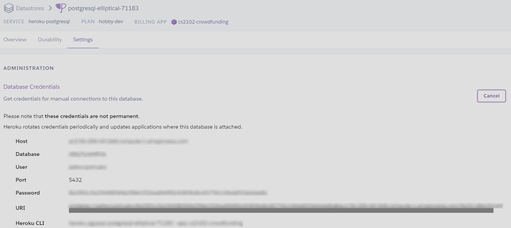

# CS2102 - Crowdfunding
A catalogue of projects looking for crowdfunding. Entrepreneurs can advertise their projects (title, description, start date, duration, keywords or categories, the amount of funding sought). Users can browse the projects and fund projects. Users can play both roles of entrepreneurs and investors. The system tracks the current amount of funding raised, brings the project to the status of “funded” and advertises this success on a page of funded projects. Each user has an account. Administrators can create, modify and delete all entries.

Read our report [here](docs/Report.pdf)

## Get started with Bitnami stacks - localhost
1. Download and install the [stack](https://bitnami.com/tag/postgresql) for your operating system
2. Navigate to /Bitnami/wappstack-7.1.21-0/apache2/htdocs
3. Clone this [repository](https://github.com/CS2102Group18/CS2102.git) here
4. Navigate to /Bitnami/wappstack-7.1.21-0 and launch manager-windows.exe
5. Start all the servers
6. Login to phppgadmin to create database and schema using sql codes from  /Bitnami/wappstack-7.1.21-0/apache2/htdocs/sql/
7. To populate database with initial data, type localhost/test/insertDummy.php in the URL bar
8. Go to localhost/public/login.php to get started

&ast; To change credentials for database, go to /Bitnami/wappstack-7.1.21-0/apache2/htdocs/php/db.php

## Get started with Heroku
1. Create new app 
2. Go to menu at the top right corner and select data
 
3. Initialise a Heroku Postgres Database
4. Credentials and connection details can be found in settings
 
5. Download [DBeaver](https://dbeaver.io/) so that you can access your database

&ast; Currently this website is already hosted on Heroku. Click [here](https://cs2102-crowdfunding.herokuapp.com/public/login.php) to view
